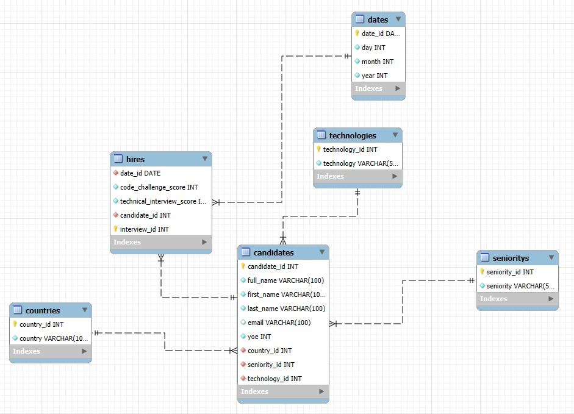

# Workshop1: End-to-end ETL process activity

## Context

Your task is to design and implement an end-to-end ETL process: extract data from a CSV file,
transform it into a dimensional data model (DDM), load it into a Data Warehouse (DW), and
finally build reports with KPIs and visualizations that query the DW (not the CSV).

You will receive a CSV file with 50,000 rows of candidate data from selection processes (randomly
generated) with the following fields. 

- First Name
- Last Name
- Email
- Country
- Application Date
- Yoe (years of experience)
-  Seniority
-  Technology
- Code Challenge Score
- Technical Interview Score

Your goal is to:

- Design a Dimensional Data Model (Star Schema).
- Load the transformed data into a Data Warehouse (DW).
- Build queries, KPIs, and visualizations directly from the DW.
- A candidate is considered HIRED if both scores are ≥ 7.
You should apply this logic to get the correct information.

## Solution

### Tech used

**DB:** MySQL

**Data processing & analysis :** Python

### DDM (Dimensional Data Model) implementation

I decided to go with a snowflake schema to potentially optimize the storage efficiency reducing the redundancy of the data and the loading times of some queries. I defined what would be my main entities, and what would be the data that describes those entities, I chose to define my main facts table as the Hires table, since is the object of the analysis proposed, and then, a secondary table that needs referencing was the Candidates table which included describing infomation as country and seniority. I separated all the secondary information in dimension tables and referenced it later on.

### Required KPI'S

- **Hires by technologies**
- **Hires through years**
- **Hires by seniority** 
- **Hires over years in: USA, Colombia, Brazil & Ecuador** 

### Personal KPI's proposed

- **Average test scores:** Reviewing the performances of the hires to ensure the quality recruited and dismiss if there's a gap in one of the fields.

 - **Hires by years of experience:** It would be useful to know if maybe the company is lacking in having fresh and ambitious talent  in their forces or if perhaps more experience is needed in the team

- **Top countries hired:** It's important to take into account where is your most prominent sources of talent.

### Results

